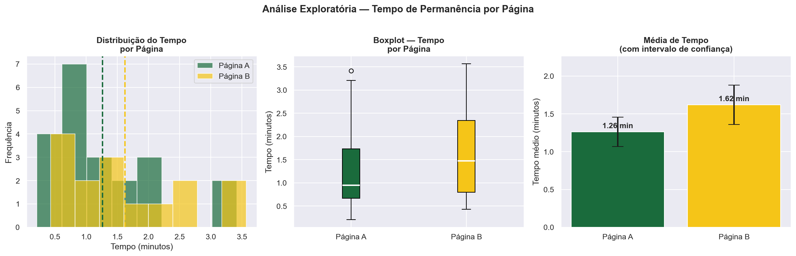
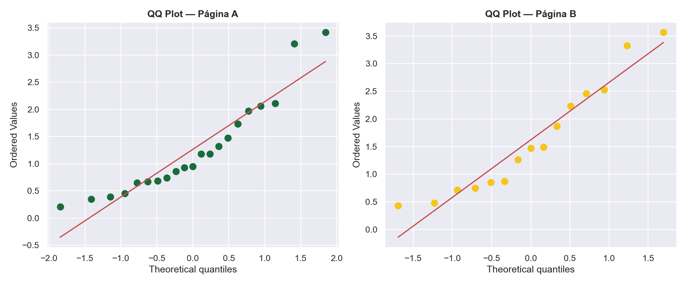
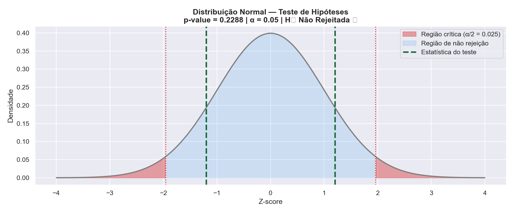
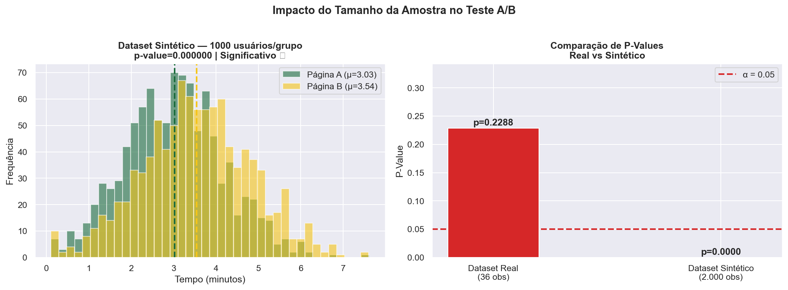
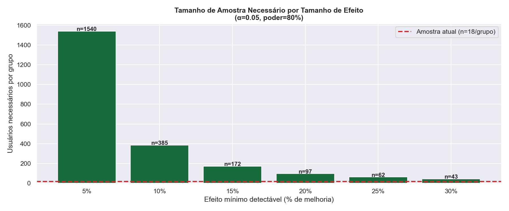

# 🧪 Teste A/B — Qual Landing Page Performa Melhor?
### Análise Estatística Completa com Python | Dataset Real + Simulação Sintética


---

## 📌 Sobre o Projeto

Este projeto aplica **Teste A/B com rigor estatístico** para comparar duas versões de uma landing page, determinando qual retém visitantes por mais tempo.

Além da análise do dataset real, o projeto inclui uma **simulação sintética com 2.000 usuários**, demonstrando o impacto do tamanho de amostra nas conclusões estatísticas — uma habilidade crítica para qualquer profissional de dados que trabalha com experimentos.

---

## 🎯 Pergunta de Negócio

> *"A nova versão da página (B) é estatisticamente melhor que a versão atual (A) em reter usuários?"*

---

## 🗂️ Estrutura do Projeto

```
📁 Projeto_Teste_AB/
├── 📁 archive/
│   └── web_page_data.csv          # Dataset real (Kaggle)
├── 📁 images/                     # Gráficos gerados
│   ├── 01_eda_distribuicao.png
│   ├── 02_normalidade_qqplot.png
│   ├── 03_teste_hipotese.png
│   ├── 04_sintetico_vs_real.png
│   └── 05_tamanho_amostra.png
├── ab_testing.ipynb               # Notebook principal
└── README.md
```

---

## 🔧 Tecnologias Utilizadas

| Ferramenta | Uso |
|-----------|-----|
| Python 3.11 | Linguagem principal |
| Pandas | Manipulação de dados |
| SciPy | Testes estatísticos (Shapiro-Wilk, T-Test, Mann-Whitney) |
| NumPy | Simulação de dados sintéticos |
| Matplotlib / Seaborn | Visualizações |

---

## 📊 Metodologia

### Etapa 1 — Análise Exploratória



| Métrica | Página A | Página B |
|---------|----------|----------|
| N amostras | 18 | 18 |
| Tempo médio | 1.26 min | 1.62 min |
| Desvio padrão | 0.88 | 1.01 |
| Diferença relativa | +28% a favor da Página B | |

---

### Etapa 2 — Verificação de Normalidade (Shapiro-Wilk)



Antes de escolher o teste estatístico, verificamos se os dados seguem distribuição normal através do **teste de Shapiro-Wilk** e dos **QQ Plots**. Este passo é frequentemente negligenciado em análises superficiais, mas é fundamental para garantir a validade do teste escolhido.

---

### Etapa 3 — Teste de Hipóteses



| | Hipótese |
|--|--|
| **H₀ (nula)** | Não há diferença entre o tempo médio das páginas A e B |
| **H₁ (alternativa)** | Existe diferença significativa entre os tempos médios |
| **α (significância)** | 0.05 |
| **P-value obtido** | 0.2288 |
| **Conclusão** | ❌ H₀ não rejeitada — diferença não é estatisticamente significativa |

> Apesar da Página B apresentar média 28% maior, **não há evidência estatística suficiente** para afirmar que ela é superior — o tamanho da amostra é insuficiente para essa conclusão.

---

### Etapa 4 — Impacto do Tamanho de Amostra



Simulamos o mesmo experimento com **1.000 usuários por grupo**:
- Dataset real (36 obs): p-value = **0.2288** → não significativo
- Dataset sintético (2.000 obs): p-value = **0.000000** → altamente significativo

**Conclusão:** O efeito pode ser real, mas a amostra é pequena demais para detectá-lo com confiança.

---

### Etapa 5 — Tamanho Mínimo de Amostra



| Efeito mínimo detectável | Usuários necessários/grupo |
|--------------------------|---------------------------|
| 5% de melhoria | 1.540 |
| 10% de melhoria | 385 |
| 15% de melhoria | 172 |
| 20% de melhoria | 97 |
| 30% de melhoria | 43 |

---

## 💡 Principais Conclusões

1. **A Página B parece melhor (+28%), mas os dados são insuficientes** para confirmar com 95% de confiança
2. **Tamanho de amostra é crítico:** precisaríamos de pelo menos 385 usuários/grupo para detectar uma melhoria de 10%
3. **Significância ≠ relevância prática:** um p-value alto não significa que a diferença não existe — pode significar que o experimento foi mal dimensionado
4. **Recomendação de negócio:** continuar o teste até atingir o tamanho mínimo de amostra calculado antes de tomar qualquer decisão

---

## ▶️ Como Executar

```bash
# Clone o repositório
git clone https://github.com/RoneyGalan/ab-testing.git

# Instale as dependências
pip install pandas matplotlib seaborn scipy numpy jupyter

# Abra o notebook
jupyter notebook ab_testing.ipynb
```

---

## 👤 Autor

**Roney Wesley Galan**
Cientista de Dados | Analista de BI

[](https://linkedin.com/in/roney-wesley-galan-ba7aa194)
[](https://github.com/RoneyGalan)

---

> *"Sem o tamanho correto de amostra, até o melhor teste estatístico pode levar à conclusão errada."*
