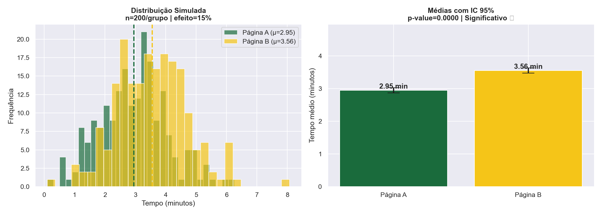
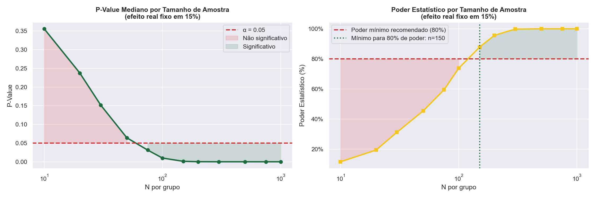
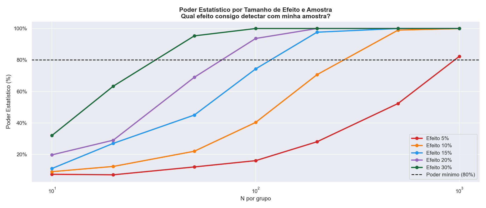
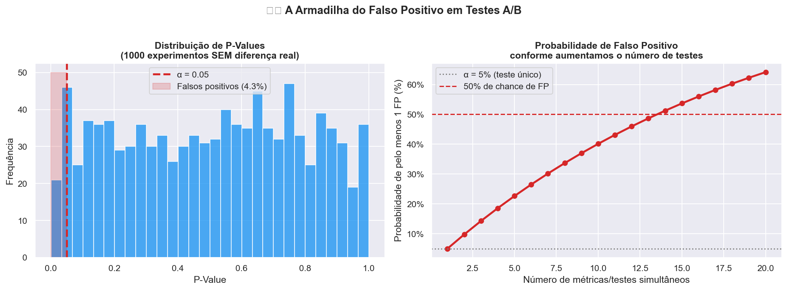
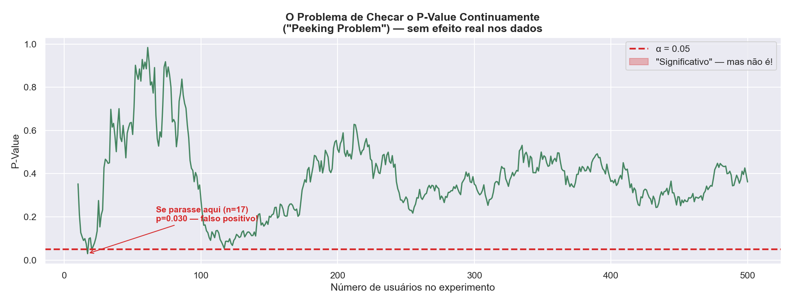
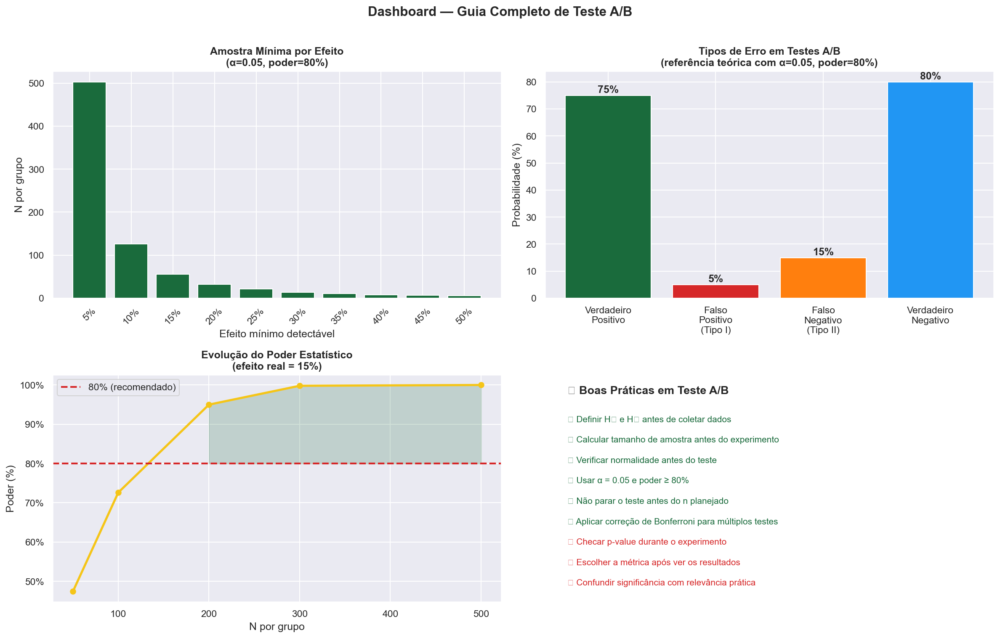

# 🧪 Teste A/B — Qual Landing Page Performa Melhor?
### Análise Estatística Completa com Python | Dataset Real + Simulação Sintética


---

## 📌 Sobre o Projeto

Este projeto aplica **Teste A/B com rigor estatístico** para comparar duas versões de uma landing page. São dois notebooks complementares:

| Notebook | Descrição |
|----------|-----------|
| `ab_testing.ipynb` | Análise com dataset real (Kaggle) — 36 usuários |
| `ab_testing_simulacao.ipynb` | Simulação sintética — poder estatístico, falso positivo e peeking problem |

---

## 🎯 Pergunta de Negócio

> *"A nova versão da página (B) é estatisticamente melhor que a versão atual (A) em reter usuários?"*

---

## 🗂️ Estrutura do Projeto

```
📁 ab-testing/
├── 📁 archive/
│   └── web_page_data.csv              # Dataset real (Kaggle)
├── 📁 images/                         # Gráficos — análise real
│   ├── 01_eda_distribuicao.png
│   ├── 02_normalidade_qqplot.png
│   ├── 03_teste_hipotese.png
│   ├── 04_sintetico_vs_real.png
│   └── 05_tamanho_amostra.png
├── 📁 images_sim/                     # Gráficos — simulação
│   ├── 01_cenario_base.png
│   ├── 02_impacto_amostra.png
│   ├── 03_cenarios_efeito.png
│   ├── 04_falso_positivo.png
│   ├── 05_peeking_problem.png
│   └── 06_dashboard_final.png
├── ab_testing.ipynb                   # Notebook 1 — dataset real
├── ab_testing_simulacao.ipynb         # Notebook 2 — simulação
└── README.md
```

---

## 🔧 Tecnologias Utilizadas

| Ferramenta | Uso |
|-----------|-----|
| Python 3.11 | Linguagem principal |
| Pandas | Manipulação de dados |
| SciPy | Testes estatísticos (Shapiro-Wilk, T-Test, Mann-Whitney) |
| NumPy | Simulação de dados sintéticos |
| Matplotlib / Seaborn | Visualizações |

---

## 📓 Notebook 1 — Dataset Real

### Análise Exploratória


| Métrica | Página A | Página B |
|---------|----------|----------|
| N amostras | 18 | 18 |
| Tempo médio | 1.26 min | 1.62 min |
| Desvio padrão | 0.88 | 1.01 |
| Diferença relativa | +28% a favor da Página B | |

### Verificação de Normalidade


### Teste de Hipóteses


| | Resultado |
|--|--|
| **P-value** | 0.2288 |
| **Conclusão** | ❌ H₀ não rejeitada — amostra insuficiente |

> A Página B parece melhor (+28%), mas não há evidência estatística suficiente com apenas 36 usuários.

### Tamanho Mínimo de Amostra


---

## 📓 Notebook 2 — Simulação Sintética

### Cenário Base Controlado


Simulamos 200 usuários por grupo com efeito real de 15% — resultado: **p-value ≈ 0.0000**, diferença detectada com clareza.

### Impacto do Tamanho de Amostra


Com efeito real de 15%, precisamos de **n=150/grupo** para atingir 80% de poder estatístico.

### Múltiplos Cenários de Efeito


Efeitos menores exigem amostras muito maiores — efeito de 5% exige mais de 1.500 usuários/grupo.

### ⚠️ A Armadilha do Falso Positivo


- Com α=0.05, **4.3% dos experimentos sem diferença real** resultam em falso positivo
- Com **14 métricas simultâneas**, há **50% de chance** de ao menos um falso positivo

### ⚠️ O Peeking Problem


Checar o p-value continuamente durante o experimento infla artificialmente os falsos positivos — com n=17 o teste já parecia significativo, mas era ruído.

### Dashboard Final


---

## 💡 Principais Conclusões

| Conceito | Lição Aprendida |
|----------|----------------|
| **Tamanho de amostra** | Quanto menor o efeito real, mais usuários precisamos |
| **Poder estatístico** | Experimentos com baixo poder perdem efeitos reais |
| **Falso positivo** | Com α=0.05, 5% dos experimentos darão significativos por acaso |
| **Múltiplos testes** | Testar 14 métricas = 50% de chance de ao menos um falso positivo |
| **Peeking problem** | Checar o resultado antes da amostra planejada infla os falsos positivos |

---

## ▶️ Como Executar

```bash
git clone https://github.com/RoneyGalan/ab-testing.git
pip install pandas matplotlib seaborn scipy numpy jupyter
jupyter notebook ab_testing.ipynb
```

---

## 👤 Autor

**Roney Wesley Galan** — Cientista de Dados | Analista de BI

[](https://linkedin.com/in/roney-wesley-galan-ba7aa194)
[](https://github.com/RoneyGalan)

---

> *"Sem o tamanho correto de amostra, até o melhor teste estatístico pode levar à conclusão errada."*
